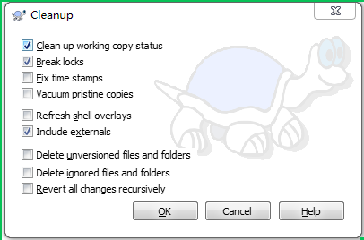

## 1、spring boot启动报异常 ##
```
Exception in thread "main" java.lang.UnsupportedClassVersionError: 
org/springframework/boot/loader/JarLauncher : Unsupported major.minor version 52.0
```
解决办法：
1. 换成jdk1.8<br>
2. pom.xml添加:<br>
```
<plugin>
        <groupId>org.apache.maven.plugins</groupId>
        <artifactId>maven-compiler-plugin</artifactId>
</plugin>
```
### 2、解决svn的working copy locked并且cleanup恢复不能的情况 ###
